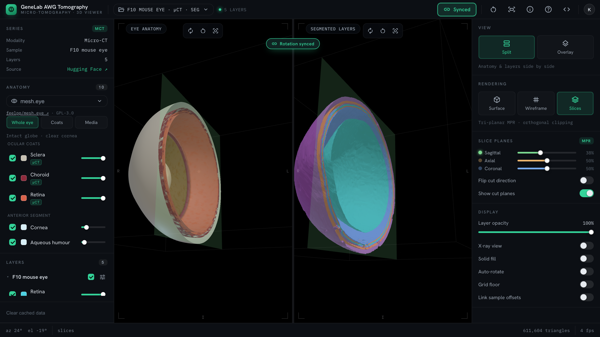

# Retina Tomography Viewer

An interactive **3D web viewer** for GeneLab AWG retina micro-tomography. It shows
two linked views side by side — a reference **eye anatomy** model on the left and
the individually toggleable **segmented tissue layers** on the right — built with
[Three.js](https://threejs.org/) and a zero-build static front end.

**Try it:** <https://gojian.github.io/awg_retina_tomography_ui/> — nothing to
install. The hosted build tracks the `main` branch, which does not yet carry the
`core/` library described below.



---

## Statement of need

The segmentations this viewer shows are distributed as full-resolution binary
STL: `eye.stl` alone is 21.1 M triangles and just over 1 GB. Looking at them has
therefore meant a multi-gigabyte download and desktop mesh or segmentation
software — a steep price for the question most people actually bring to this
data, which is what the segmentation looks like and how its coats sit relative
to a whole eye.

This viewer answers that question in a browser tab, with nothing installed and a
first visit of about 405 KB. It is built for three audiences: the GeneLab AWG
space-biology researchers who produced the scans and want to check or show them;
ophthalmology and anatomy teaching, where the segmented coats can be read
against a published reference eye in the other pane; and reviewers or readers of
the dataset who want to see what is in it before committing to a download.

It is a viewer, not an analysis tool. The meshes it ships are decimated, so it
is meant for orientation, teaching and qualitative inspection — **not** as a
substitute for the source mesh in morphometric analysis. [Benchmarks](#benchmarks)
quantifies exactly how much accuracy that costs.

---

## Features

- **Split, synchronised views** — rotate the eye anatomy and the segmented layers
  in tandem (the **Sync** button mirrors orbit orientation while each view keeps
  its own zoom), or explore them independently.
- **Switchable reference eyes** — pick from three published open-source eye
  models (mesh.eye, the Feel++ CAD eye, and the Upatras OpenSim oculomotor model
  with its six extraocular muscles). Each is shipped as separate named
  structures — cornea, aqueous humour, iris, lens, vitreous, sclera, choroid,
  retina, zonules, retinal vessels, lamina cribrosa, optic nerve, and (in the
  Upatras model) the globe, the cornea/pupil and the six extraocular muscles —
  every one independently toggleable, recolourable, fadeable and sliceable, with
  per-model presets. The ocular coats the µCT segmentation also resolves —
  retina, choroid and sclera, or the globe in the Upatras model — are tagged
  `µCT`, so the two panes can be read against each other.
- **On-demand layers** — each segmented structure loads only when toggled, with a
  real progress bar, a cancel control, and recolour / opacity sliders.
- **Fast by default** — heavy source scans (≈1 GB STL meshes) are decimated and
  Draco-compressed to a few hundred KB each and shipped with the app, so a first
  visit downloads about 405 KB over the wire — 534 KB raw — instead of over
  1 GB, rising to 3.2 MB only if every layer is toggled on. The numbers come
  from `tools/bench`; see [Benchmarks](#benchmarks).
- **Browser caching** — assets are cached via the Cache Storage API, so they
  download once and load instantly afterwards.
- **Responsive** — a draggable divider on desktop; a collapsible drawer and
  stacked views on mobile.

---

## Running locally

### Requirements

There is no build step and nothing to `npm install` for the app itself, but the
page is not self-contained. It needs:

- **A browser with WebGL 2 and import maps.** Three.js r169 asks for a `webgl2`
  context and has no WebGL 1 fallback, and `index.html` resolves `three` and
  `three/addons/` by bare specifier from an inline `<script type="importmap">`.
  In practice that means Chrome/Edge 111+, Firefox 113+ or Safari 16.4+ — import
  maps alone would allow older releases, but `styles.css` uses `color-mix()`,
  which lands in Chrome/Edge 111, Firefox 113 and Safari 16.2, and older
  browsers render the scene with degraded UI colours. The browser suite exercises
  Chromium only.
- **HTTP, not `file://`** — ES modules and the Cache Storage API need
  `http://localhost` or HTTPS.
- **Python 3**, if you use the repo's own dev server or run the browser tests.
- **Outbound HTTPS to four third-party hosts.** The app is not offline-capable:

  | Host | What it serves | If it is blocked |
  |---|---|---|
  | `esm.sh` | Three.js r169 (`three`, `three/addons/`, pinned in the `index.html` import map) | nothing renders at all |
  | `www.gstatic.com` | the Draco decoder 1.5.7 (`core/mesh-parsers.js`) | every mesh, including the bundled anatomy, fails to decode |
  | `huggingface.co` | the default dataset manifest, the per-layer size probes, and any mesh with no optimized copy in `optimized/` | an empty layer tree and a "Failed to load dataset" toast |
  | `fonts.googleapis.com` / `fonts.gstatic.com` | Hanken Grotesk, IBM Plex Mono, Material Symbols Outlined | icon buttons show words instead of glyphs |

Then serve the folder over HTTP:

```bash
npm run serve                  # tools/dev-serve.py → http://127.0.0.1:8123
# or, with no repo scripts at all:
python3 -m http.server 8000    # → http://localhost:8000
```

`npm run serve` sends `Cache-Control: no-store` on every response, so edits to
the ES modules and GLBs show up on a plain reload instead of being served stale
from the browser's HTTP cache; it is the same server the browser tests start. It
binds `127.0.0.1` and takes an optional port: `npm run serve -- 8000`.

### Running against the checked-in dataset

`local/` holds a five-layer F10 mouse-eye sample — a CSV manifest and its five
Draco GLBs — so the viewer runs without reaching Hugging Face:

```
http://127.0.0.1:8123/?dataset=local/F10/F10_layers.csv&demo=off
```

That is the dataset the Playwright suite pins itself to. It removes one host,
not all four: Three.js, the Draco decoder and the webfonts still come from their
CDNs, so this is independence from the dataset, not an offline run. A genuinely
air-gapped deployment means vendoring `three` into the import map, self-hosting
or dropping the font links, and embedding the core in your own page with
`createLoaders({ dracoDecoderPath: './vendor/draco/' })` — see
[Loaders and parsers](#loaders-and-parsers).

### Useful URL parameters

| Parameter  | Purpose                                              |
|------------|------------------------------------------------------|
| `?dataset=<url>`  | Load an alternative manifest (CSV).           |
| `?model=<id>`     | Pick the reference eye: `mesheye`, `humaneye`, `upat`. |
| `?anatomy=<url>`  | Override the left-pane anatomy model URL outright. |
| `?demo=off`       | Suppress the synthetic duplicate sample (see [Data](#data)). |

---

## Troubleshooting

**"Failed to load dataset" and an empty layer tree.** The default manifest lives
on Hugging Face. The app already retries it four times with backoff — Hugging
Face's edge answers the first cold request with HTTP 405 — so a reload is worth
trying first. If it persists you are offline, behind a proxy that blocks
`huggingface.co`, or hitting an outage: run against the bundled sample instead
with `?dataset=local/F10/F10_layers.csv`, which is same-origin.

**A blank or black pane.** WebGL 2 is unavailable or blocked. Check
`chrome://gpu` (or `about:support` on Firefox) and the browser console, and see
the [requirements](#requirements) above. Include browser, OS and the console
output in any issue — WebGL behaviour varies between machines more than the rest
of the app does.

**The layer tree fills in but nothing appears in the right pane.** Every shipped
mesh is Draco-compressed and the decoder is fetched from
`https://www.gstatic.com/draco/versioned/decoders/1.5.7/`. If that host is
blocked, decoding fails after the download succeeds. Allow `gstatic.com`, or
self-host the decoder and pass `dracoDecoderPath` (see
[Loaders and parsers](#loaders-and-parsers)).

**Stale geometry after an asset changed.** Meshes are kept in Cache Storage.
**Clear cached data** in the left rail empties it (it asks first, then everything
re-downloads on the next load); clearing the browser's site data works too, and
`clearCache()` from `asset-loader.js` is the same thing programmatically.

**Nothing happens when you open `index.html` directly.** `file://` cannot load ES
modules or use the Cache API — serve the folder over HTTP as above.

---

## How it works

The application is a thin view over a DOM-free library. `core/` owns the scenes,
the view state and every transition; it takes its renderer and controls through
injected **adapters** and its bytes through an injected **io**, and reports back
through an **event emitter** that both the controller and the two rails render:

```
  index.html · styles.css
       │
       ▼
  viewer.js — controller entry: reads the URL, builds the adapters and the io,
  wires the top-level controls, owns the requestAnimationFrame loop
       │
       ├── createWorkbench({ adapters, io }) ──┐
       │                                       │
       │        adapters ──▶ app/browser-adapters.js   WebGLRenderer,
       │                                               OrbitControls, ResizeObserver
       │                     core/adapters-headless.js stub renderer, for Node
       │                                       │
       │        io ───────▶ asset-loader.js    │  streaming download + Cache Storage
       │                                       ▼
       │                            core/  (DOM-free)
       │                            panes · layers · anatomy · clipping ·
       │                            framing · orientation · view state
       │                                       │
       └──── wb.* calls ───────────────────────┤
                                               │ events
                     ┌─────────────────────────┴───────────────────┐
                     ▼                                             ▼
              viewer.js                                        app/ui/
        (the top-level controls)                chrome.js, layer-panel.js,
                                                anatomy-panel.js — DOM in,
                                                wb.* calls out, events rendered back
```

The two rails take the same `io` as the workbench, so a cached mesh is
recognised the same way in the rail and in the scene.

| File              | Responsibility                                             |
|-------------------|------------------------------------------------------------|
| `index.html`      | Markup and the Three.js import map.                         |
| `styles.css`      | All styling and theming: the CSS custom properties, both rails, the responsive / mobile layout. |
| `core/`           | The DOM-free library: scenes, cameras, clipping, sync, layer & anatomy loading, view state — events out, adapters in. Entry `core/index.js`; see [Using the core in your own page](#using-the-core-in-your-own-page). |
| `app/browser-adapters.js` | The one browser-only seam: WebGL renderer, OrbitControls on the canvas, resize observation. |
| `app/ui/`         | The view: `chrome.js` (toasts, confirm, HUD, study menu, status-bar mirrors of the view events), `layer-panel.js` and `anatomy-panel.js` (the two rails — DOM in, `wb.*` calls out, events rendered back). |
| `viewer.js`       | The controller entry: builds the workbench with the browser adapters, reads the URL, wires the top-level controls and runs the frame loop. |
| `data-loader.js`  | Loads & parses the dataset manifest; resolves optimized assets. |
| `asset-loader.js` | Streaming downloads with progress, cancellation & caching. |
| `optimized/`      | Pre-optimized GLBs that ship with the app.                 |
| `optimized/anatomy/` | The reference eye models, their provenance and licences. |
| `local/`          | The small checked-in F10 sample (CSV manifest + five Draco GLBs), served same-origin. |
| `test/`           | Unit tests (Node's runner) and the Playwright browser spec under `test/e2e/`. |
| `tools/`          | `bench/` (asset and payload measurement), `optimize/` (the GLB pipeline), `dev-serve.py`. |

### Data

The dataset **manifest** (a CSV) and the original full-resolution scans live in a
[Hugging Face dataset](https://huggingface.co/datasets/kush1434/awg_retina_tomography_ui).
The manifest lists, per sample, each segmented structure and a link to its mesh.

#### The manifest format

`?dataset=<url>` points the viewer at any CSV with these columns. Header names
are matched case-insensitively and column order does not matter:

| Column | Required | Meaning |
|---|---|---|
| `sample_name` | yes | Groups rows into samples and labels the sample. Rows sharing a name become one sample. |
| `file_name` | yes | Identifies the structure within its sample — the structure id is `<sample>__<file_name>` — and is the label when `seg_mesh_label` is absent. |
| `seg_mesh_link` | yes | Where the mesh is downloaded from. The extension picks the parser: `.glb` / `.gltf` are read as glTF, anything else as binary STL. |
| `seg_mesh_label` | no | Display label; falls back to `file_name` when missing or empty. |
| `sample_link` | no | Provenance link, shown as the ↗ beside the sample. Defaults to empty. |
| `notes` | no | Free text carried onto the structure record (parsed, but not displayed today). Defaults to empty. |

A row missing any of the three required values is skipped silently, so a
mistyped header produces an empty layer tree rather than an error — check the
header row first if nothing appears. [`local/F10/F10_layers.csv`](local/F10/F10_layers.csv)
is a working five-row example, and the manifest the browser tests drive the app
with.

#### Optimized copies

At load time the app rewrites each **STL** mesh in the manifest to an
**optimized** same-origin copy under `optimized/` (decimated, Draco-compressed,
tiny), and falls back to the original on Hugging Face when no such copy has been
published. Sample 1's `eye` and `feature` are the rows that take this path. The
rule is by extension, not by sample: rows that are already glTF keep their
manifest URL, so the F10 ocular coats stream from Hugging Face, and the locally
shipped `optimized/F10_layers_solid/` meshes are fetched only while the **Solid
fill** toggle is on. The Hugging Face data is never modified.

#### The synthetic demo sample

When the manifest holds only one sample, the app appends a synthetic duplicate
of it — the same meshes, re-coloured and offset along x — so that the
multi-sample overlay, the per-sample offsets and the opacity controls have
something to work on out of the box. It is labelled `<sample> · copy` and
badged "synthetic demo copy" in the layer rail; it is not a second specimen. Add
`?demo=off` to suppress it (the end-to-end tests always do). A manifest with
more than one sample never gets one, and `?demo=off` is then a no-op.

### Reference eye models

The left pane is **not** NASA data — it is a published open-source eye model,
shown for orientation:

| id | Model | Structures | Licence |
|----|-------|-----------:|---------|
| `mesheye`  | [feelpp/mesh.eye](https://github.com/feelpp/mesh.eye) — *A 3D geometrical model and meshing procedures for the human eyeball* ([doi:10.5281/zenodo.13829740](https://doi.org/10.5281/zenodo.13829740)) | 10 | GPL-3.0 |
| `humaneye` | The SolidWorks CAD eye that mesh.eye derives from; adds zonules and retinal vessels | 10 | GPL-3.0 |
| `upat`     | [Upatras OpenSim oculomotor model](https://simtk.org/projects/eye) ([arXiv:1807.07332](https://arxiv.org/abs/1807.07332)) — globe + six extraocular muscles | 8 | CC BY 4.0 |

All three are **human** eyes while the segmented scan is **mouse**; they are
references for orientation, not for morphometric comparison. The model menu also
lists the projects surveyed that ship no 3D geometry (ISETBio, OpenRetina,
V-Cornea, OpenEyeSim, pulse2percept, Open Source Brain), disabled and with the
reason, rather than hiding them.

The models keep their upstream licences and are merely aggregated with the
viewer's MIT code. Full provenance, structure tables and licences:
[`optimized/anatomy/README.md`](optimized/anatomy/README.md).

### Regenerating optimized assets

The optimized GLBs are produced from the source meshes with
[`gltf-transform`](https://gltf-transform.dev/) (decimation + Draco compression);
the eye models are rebuilt from their upstream sources with
[`tools/optimize/anatomy/build-anatomy.sh`](tools/optimize/anatomy/build-anatomy.sh).
See [`tools/optimize/`](tools/optimize) for the pipeline.

---

## Using the core in your own page

`core/` is the viewer without the viewer: scenes, cameras, clipping, camera
sync and the layer / anatomy loading state machines, with no DOM anywhere in
its module graph. It takes its renderer and controls through injected
**adapters**, its bytes through an injected **io**, and reports every
transition through an **event emitter** — so the same library drives the page
in this repo, a page of your own, or a Node process with no browser at all.

Every exported function and method is listed in the
[API reference](docs/api.md); this section is the tour.

### Getting it

It is not on npm. Install it from git, or copy `core/`,
`app/browser-adapters.js` and `asset-loader.js` into your own project and
import them by relative path:

```bash
npm install github:kush1434/awg_retina_tomography_ui#v1.0.0 three@^0.169.0
```

Pin `three`: it is a peer dependency declared as `^0.169.0`, and a bare `three`
installs a far newer release that does not satisfy it, so npm warns on install.
Pinning the tag rather than a branch keeps the install reproducible. The core
library currently lives on this fork; once it lands on the upstream default
branch, `github:GoJian/awg_retina_tomography_ui#v1.0.0` works the same way.

| Import | What you get |
|---|---|
| `awg-retina-tomography-ui` | the core barrel — `createWorkbench`, `createPane`, the clipping / framing / materials helpers ([`core/index.js`](core/index.js)) |
| `awg-retina-tomography-ui/core/<module>.js` | one core module on its own — `pane.js`, `clipping.js`, `layers.js`, `framing.js`, `materials.js`, … Both this and the extensionless `core/pane` resolve. Reach for it only to sidestep a name clash: the package is `sideEffects: false`, so a bundler already drops whatever you do not import from the barrel |
| `awg-retina-tomography-ui/browser` | `browserAdapters(el)` and `mountPane(pane, el)` — the WebGL / OrbitControls / ResizeObserver half |
| `awg-retina-tomography-ui/headless` | `headlessAdapters()` and `stubElement()` — a stub renderer plus the real OrbitControls, for Node. Deliberately not on the barrel, so a browser build never pulls them in |
| `awg-retina-tomography-ui/asset-loader` | `fetchBuffer` / `isCached` / `clearCache` — streaming downloads with progress, cancellation and Cache Storage |
| `awg-retina-tomography-ui/data-loader` | the CSV manifest parser and the asset-resolution helpers — `loadCSVData`, `samplesData`, `fileKind`, `deriveOptimizedURL`, `resolveStructure`, `probeSizes`, `formatBytes` — if you want this repo's dataset format too |

### A minimal page

The core imports `three` and `three/addons/` by bare specifier, so a page with
no build step needs the same import map `index.html` carries (a bundler
resolves both from `node_modules` instead). The two mount elements need a size
of their own, and the canvas needs a CSS size — see
[the adapter contract](#writing-your-own-adapters) for why:

```html
<script type="importmap">
{ "imports": {
    "three": "https://esm.sh/three@0.169.0",
    "three/addons/": "https://esm.sh/three@0.169.0/examples/jsm/",
    "awg/": "./node_modules/awg-retina-tomography-ui/"
} }
</script>
<style>
  html, body { margin: 0; height: 100%; }
  body { display: flex; }
  #left, #right { flex: 1; height: 100vh; }
  #left canvas, #right canvas { display: block; width: 100%; height: 100%; }
</style>
<div id="left"></div><div id="right"></div>

<script type="module">
import { createWorkbench } from 'awg/core/index.js';
import { browserAdapters, mountPane } from 'awg/app/browser-adapters.js';
import { fetchBuffer, isCached } from 'awg/asset-loader.js';

// One sample with one layer, in the shape `layers` wants (described below).
// Both URLs here are placeholders: serve files of your own at these paths.
const samples = [{
  id: 's1', label: 'Sample 1',
  offset: { x: 0, y: 0, z: 0 }, opacity: 1,
  structures: [{
    id: 's1__retina', sampleId: 's1', label: 'Retina',
    path: '/meshes/retina.glb',         // what io.fetchBuffer is called with
    kind: 'gltf', color: 0xd9634c, opacity: 1, bytes: null,
  }],
}];

const left = document.getElementById('left'), right = document.getElementById('right');
const wb = createWorkbench({
  adapters: { glb: browserAdapters(left), stl: browserAdapters(right) },
  io: { fetchBuffer, isCached },
  anatomyUrl: '/models/eye-anatomy.glb',   // copy optimized/anatomy/eye-anatomy.glb here (343 KB, Draco)
});
mountPane(wb.panes.glb, left);
mountPane(wb.panes.stl, right);
requestAnimationFrame(function frame(now) { wb.tick(now); requestAnimationFrame(frame); });

wb.on('layer:state', ({ id, state }) => console.log(id, state));   // render the events you care about

wb.anatomy.load();                                   // reference eye → left pane
wb.layers.setSamples(samples);                       // your meshes → right pane
wb.layers.load(wb.layers.findStructure('s1__retina'));
</script>
```

`createWorkbench` takes `{ adapters, io, loaders, parsers, modelId, anatomyUrl,
startTime }`. `adapters` is required — one `{ createRenderer, createControls }`
pair for both panes or `{ glb, stl }` for one each — and is the only place a
WebGL context is made. `io` is any `{ fetchBuffer(url, { signal, onProgress }),
isCached(url) }`. Nothing is loaded until you ask.

`anatomyUrl` overrides the reference-eye file outright. Drop it and the built-in
registry's default is used instead — but the registry's URLs
(`optimized/anatomy/eye-anatomy.glb` and its siblings) are plain relative paths,
resolved against *your* page, so either serve an `optimized/anatomy/` directory
at that path or keep the override. Note that `/models/...` above is
root-relative: it resolves only when you control the document root.

### Writing your own adapters

Adapters are the extension point: swap them and the same library renders
somewhere else. Both functions are mandatory — `createPane` throws
`TypeError: createPane: adapters { createRenderer, createControls } are required`
if either is missing. The full contract, all of it exercised by
`core/adapters-headless.js`:

- **`createRenderer(opts)`** is called once per pane with
  `{ antialias: true, alpha: false, stencil: true }` and must return an object
  the core can write `outputColorSpace` and `localClippingEnabled` to, read
  `domElement` from, and call `setSize(w, h, false)`, `render(scene, camera)`,
  `clearStencil()` (used by the stencil caps when slicing) and `dispose()` on.
  It also reads `info.render.triangles` for the `stats` event; a stub may leave
  that at 0.
- **`createControls(camera, domElement)`** is called with the renderer's own
  `domElement` and must return OrbitControls-compatible controls: the core
  writes `enableDamping`, `dampingFactor` and `autoRotateSpeed`, calls
  `update()` every tick and `dispose()` on teardown. `stubElement()` from the
  `./headless` subpath is enough of a DOM element to host the real
  OrbitControls under Node.
- In a browser, mount the canvas **before returning** from `createRenderer` —
  `createControls` runs immediately afterwards and expects an element that is
  already in the document. `browserAdapters` does this.
- `pane.resize(w, h)` calls `setSize(w, h, false)`, which deliberately never
  writes the canvas's CSS. Your page must therefore give the mount element a
  height and give the canvas `display: block; width: 100%; height: 100%` —
  otherwise the canvas's intrinsic attribute size feeds back through
  `mountPane`'s ResizeObserver and the pane ends up sized by its own canvas.
  See `.pane canvas` in `styles.css` for this repo's rule.

### Loaders and parsers

`loaders` and `parsers` are the second seam. `createLoaders({ dracoDecoderPath })`
builds the STL / glTF / Draco trio, defaulting the decoder to
`https://www.gstatic.com/draco/versioned/decoders/1.5.7/` — the core's only
third-party fetch. Point it at files you host yourself:

```js
import { createLoaders, createWorkbench } from 'awg/core/index.js';

const loaders = createLoaders({ dracoDecoderPath: '/vendor/draco/' });
const wb = createWorkbench({ adapters, io, loaders });
```

Passing `loaders` alone is enough: `createWorkbench` derives `parsers` from it
when `parsers` is omitted. Pass `parsers` only to replace the parsing itself —
`createMeshParsers(loaders)` returns `parseSTL(buffer, structure)` (a segmented
layer as one mesh in its structure's colour), `parseGLTF(buffer)` (a segmented
layer scene, every mesh re-skinned white) and `parseAnatomyGLTF(buffer)` (the
reference eye, materials and node names kept).

To self-host the decoder for a copy of the shipped app, put the Draco decoder
files matching decoder 1.5.7 (three r169 ships them under
`node_modules/three/examples/jsm/libs/draco/`) somewhere your site serves, then
pass `loaders: createLoaders({ dracoDecoderPath: '/vendor/draco/' })` into the
`createWorkbench` call in `viewer.js`. As shipped, the app uses the gstatic
default.

### The records `layers` takes

`wb.layers.setSamples(...)` wants the data-loader's own records. They are plain
objects, so you can build them yourself — one sample per subject, one structure
per downloadable mesh:

```js
const samples = [{
  id: 's1',                            // unique; the `sampleId` in every event
  label: 'Sample 1',
  offset: { x: 0, y: 0, z: 0 },        // position in the shared workspace, as a fraction of its size
  opacity: 1,                          // whole-sample opacity multiplier
  structures: [{
    id: 's1__retina',                  // unique; the `id` in every layer:* event
    sampleId: 's1',
    label: 'Retina',
    path: '/meshes/retina.glb',        // what io.fetchBuffer is called with
    kind: 'gltf',                      // 'gltf' → glTF/GLB, anything else → binary STL
    color: 0xd9634c,
    opacity: 1,
    bytes: null,                       // size when known; over 400 MB `layers.isHeavy()` is true
  }],
}];
```

`color` and `opacity` are written back by `setColor` / `setOpacity`, and
`offset` by the offset setters — the records are the live state, not a copy.

### The events

`wb.on(name, fn)` returns an unsubscribe; `wb.once` and `wb.off` are there too.
The core never touches a widget — this table is the whole interface out:

| Event | Payload |
|---|---|
| `rendermode` | `{ mode: 'surface' \| 'wireframe' \| 'slices' }` |
| `clip` | frozen `{ x: { on, pos }, y, z, flip, showPlanes }` |
| `layout` | `{ layout: 'split' \| 'overlay' }` |
| `sync` `autorotate` `grid` `linkoffsets` `solidfill` | `{ on }` |
| `opacity` | `{ global }` |
| `sample:offset` | `{ sampleId, axis, value }` |
| `layer:state` | `{ id, state: 'idle' \| 'loading' \| 'loaded' \| 'error', phase?: 'start' \| 'cache' \| 'build', cached? }` |
| `layer:progress` | `{ id, loaded, total, pct }` (`pct` is 0 when the response has no `Content-Length`) |
| `layer:error` | `{ id, label, error }` |
| `layers:visible` | `{ anyVisible, visibleIds }` |
| `anatomy:model` | `{ id, model, isDefault, preset }` |
| `anatomy:status` | `{ state: 'idle' \| 'loading' \| 'loaded' \| 'error', phase?: 'start' \| 'download' \| 'build', pct?, loaded?, total?, fromCache?, message? }` |
| `anatomy:parts` | `{ modelId, keys, unmatched, preset }` |
| `anatomy:preset` | `{ name, preset }` |
| `anatomy:style` | `{ key, state: { visible, color, opacity } }` |
| `anatomy:opacity` `anatomy:visible` `anatomy:offset` | `{ value }` / `{ on }` / `{ axis, value, offset }` |
| `stats` | `{ az, el, triangles, fps }` — emitted from `tick(now)`, at most every 250 ms |

Neither controller ever rejects: a failed download arrives as `layer:state
error` + `layer:error` (or `anatomy:status error`), and a cancelled one as a
single `idle`.

### Without a browser

`headlessAdapters()` swaps the WebGL renderer for a stub and keeps the real
OrbitControls, so the whole library — loading, styling, clipping, framing,
camera sync — runs under Node. That is how `npm test` exercises it; see
[`test/core/`](test/core) for worked examples.

---

## Tests

Node >= 20 (CI runs the unit suite on 20 and 22) and, for the browser suite,
python3 on PATH — Playwright starts the site itself with `tools/dev-serve.py`.

```bash
npm ci                         # three is a devDependency (headless core tests)
npm test                       # unit tests — Node >= 20
npx playwright install chromium
npm run test:e2e               # browser tests — needs python3 on PATH
```

`npm test` covers the manifest parser, the optimized-asset resolution, the
Hugging Face retry, the streaming/caching asset loader, the geometry code
behind the reported decimation error, and the whole `core/` library run
headless — pane construction with a stub renderer and the real OrbitControls,
clipping planes and caps, camera sync, STL/glTF parsing of synthetic meshes,
the layer and anatomy loading state machines, and every workbench transition —
plus a static scan proving no core module reaches for a browser global, and
the `app/ui/` view modules rendered into a small fake DOM over a headless
workbench (507 tests, Node's built-in runner; `three` is the only devDependency
the unit tests need — `@playwright/test` serves the browser suite alone).
`npm run test:e2e` drives the actual application in Chromium — Playwright
starts `tools/dev-serve.py` on port 8124 itself, so python3 must be on PATH —
and checks that WebGL starts, that a toggled layer reaches the GPU, that the
asset cache fills, and that the controls behave (18 tests). Both run in CI on
every pull request and on pushes to `main`, along with a decode of every
shipped asset.

## Benchmarks

```bash
cd tools/bench && npm install   # one-time; bench has its own dependencies
node bench.mjs                  # or `npm run bench` from the repo root
```

Reports the size, triangle count and compression of every shipped asset, and
the first-paint payload. `node --max-old-space-size=16384 bench.mjs --verify
<source.stl> <optimized.glb>` measures the surface error introduced by
decimation; the full-resolution sources are not in git (~1.0 GB + ~150 MB), so
fetch them first — see
[Getting the source meshes](tools/bench/README.md#getting-the-source-meshes).

Measured on the shipped assets:

| Source mesh | Triangles | Size | Shipped | Reduction | Mean surface error | Area change |
|---|---:|---:|---:|---:|---:|---:|
| `eye.stl` | 21,141,576 | 1008 MB | 633 KB | 1631x | 0.017% | +0.63% |
| `feature.stl` | 3,131,220 | 149 MB | 325 KB | 471x | 0.006% | +0.21% |

First paint: a 190 KB app shell (61 KB gzipped) plus the 343 KB default anatomy
= 534 KB raw, 405 KB over the wire. Toggling on every segmented layer brings the
total to 3.2 MB.

Errors are symmetric point-to-surface distances as a fraction of the
bounding-box diagonal. Tail error is larger than the mean: for `eye.stl` the p99
of the worse direction is 0.062% and the symmetric Hausdorff distance 3.99%; for
`feature.stl`, 0.024% and 1.10%. The viewer is meant for orientation, teaching
and qualitative inspection — **not** as a substitute for the source mesh in
morphometric analysis.

## Contributing

Bug reports, questions and pull requests are welcome — see
[`CONTRIBUTING.md`](CONTRIBUTING.md). Release notes are in
[`CHANGELOG.md`](CHANGELOG.md).

---

## Deployment

This is a static site; it deploys as-is to any static host.

- **Vercel** — `npx vercel` from this folder (config in `vercel.json`), or import
  the repo at vercel.com.
- **GitHub Pages** — enable Pages → "GitHub Actions"; the workflow in
  `.github/workflows/pages.yml` publishes the site on every push to `main`.

---

## Credits

- [Three.js](https://threejs.org/) · [STLLoader](https://threejs.org/docs/#examples/en/loaders/STLLoader) · [GLTFLoader](https://threejs.org/docs/#examples/en/loaders/GLTFLoader) · [OrbitControls](https://threejs.org/docs/#examples/en/controls/OrbitControls)
- Source scans produced with [3D Slicer](https://www.slicer.org/) and hosted on [Hugging Face](https://huggingface.co/datasets).
- Reference eye models from [feelpp/mesh.eye](https://github.com/feelpp/mesh.eye) and the [Upatras OpenSim oculomotor model](https://gitlab.com/mitkof6/upat_eye_model), tessellated with [gmsh](https://gmsh.info).

## License

MIT © 2025 — except the eye models under `optimized/anatomy/`, which keep their
upstream licences (GPL-3.0 and CC BY 4.0). See
[`optimized/anatomy/README.md`](optimized/anatomy/README.md).
